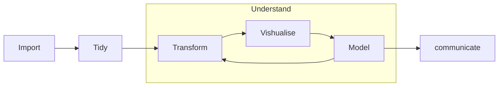

```mermaid
graph LR
subgraph Understand
D[Transform]
E[Vishualise]
F[Model]
end
A[Import] -->B[Tidy]	
B -->D[Transform]	
D[Transform] -->E[Vishualise]	
F[Model]-->D[Transform]	
E[Vishualise]-->F[Model]
F[Model]-->aa[communicate]

```
